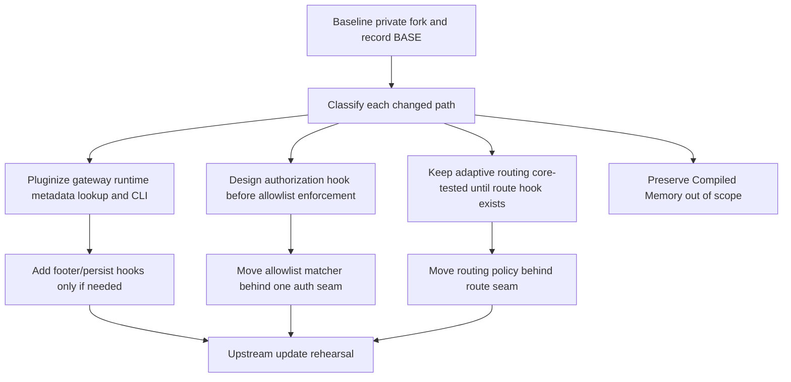

# Custom Features Pluginization Architecture Record — 20-06-2026

**Status:** Pluginization implementation completed, upstream integration completed through PR #4, and documentation converted to manual/reference form after the documentation playbook update.
**Scope:** Active private-fork customizations after the completed `account-usage` plugin pilot, excluding Compiled Memory Architecture implementation.
**Source inventory:** `docs/manual/2026-06-20 Hermes Active Customized Features.md`.
**Sequencing context:** `docs/plans/2026-06-01 Compiled Memory Architecture Implementation Plan.md`.
**Archived precedent:** `docs/manual/2026-06-01 Codex Account Usage Plugin As-Built Validation Record.md` is implemented and retained as the as-built validation record.
**Future update playbook:** `docs/manual/2026-06-20 Hermes Private Fork Upstream Update Playbook.md`.

> **QA status, 2026-06-20:** Implementation QA is complete. The final targeted implementation run passed **399 tests, 0 failed, across 15 files**. The earlier focused account-usage run passed **48/48**, and the account-usage implementation also passed in the broader QA run. Anthropic account usage is confirmed unsupported for Hermes and is not part of this migration scope.

> **Upstream integration update, 2026-06-20:** PR #4 merged latest NousResearch upstream into this private fork. Final synced local/remote `main` is `3d3f55992`; the integration merge commit before PR merge was `1ae1434f7`; the upstream commit merged was `5a53e0f0f`. Post-integration targeted validation passed **408 tests, 0 failed** across upstream/plugin/custom-feature checks.

> **Compiled Memory note:** Compiled Memory Architecture remains out of scope for this completed pluginization record. This document preserves it only as a sequencing reference and does not update its implementation plan.

## 1. Purpose

This record documents how private-fork merge risk was reduced before updating from the configured NousResearch upstream remote. Active Hermes customizations moved behind bundled plugins where existing extension seams were sufficient, and unavoidable core work was isolated into tiny, generic, upstream-compatible hook seams.

PR #4 is the first completed validation of that goal after the pluginization work. The merge succeeded, but it exposed an important update pitfall: upstream extracted authorization behavior into `gateway/authz_mixin.py`, so message-allowlist/auth seams had to be re-injected there rather than only in `gateway/run.py`. Future update work should treat this document as the migration design record and use `docs/manual/2026-06-20 Hermes Private Fork Upstream Update Playbook.md` as the step-by-step operational checklist.

The migration target was not “every customization becomes a plugin immediately.” The implemented target is:

1. pluginize the parts that are already plugin-shaped;
2. keep security- and routing-critical behavior stable behind generic hook seams;
3. avoid broad edits to hot upstream files;
4. make upstream updates safer by shrinking private fork deltas to bundled plugins, tests, a quota service seam, and small generic hooks.

## 2. Explicit non-goals

- Do not reopen the account usage pilot as implementation work; use its as-built validation plan only for maintenance, targeted tests, and rollback guidance.
- Do not add Anthropic account usage support; Anthropic is confirmed unsupported for Hermes account usage and remains out of scope.
- Do not rewrite gateway, routing, or session internals beyond the generic seams already implemented for this migration.
- Do not weaken security gates; the implemented authorization hook remains fail-closed when allowlist enforcement is enabled and hook callbacks do not explicitly allow.
- Do not change prompt-cache behavior by mutating toolsets, system prompts, or memory injection mid-session.
- Do not make runtime status quieter in a way that hides terminal failures from users.
- Do not move installer/update behavior into a plugin; it is not plugin-shaped.
- Do not edit Compiled Memory Architecture documentation in this session except to preserve that it is out of scope.

## 3. Current inventory and classification

| Feature | As-built status | Migration class | Follow-up action |
| --- | --- | --- | --- |
| Codex account usage improvements | Active, pluginized; earlier focused run passed 48/48 and broader implementation QA passed | Done | Keep as precedent and rollback record |
| Compiled Memory Architecture | Planned plugin-first feature; not updated in this session | Independent plugin-first work | Out of scope here; preserve existing plan |
| Gateway runtime footer and response references | Hook seam and bundled plugin present; response-ref persistence remains core-owned | Pluginized operator/notification surfaces plus retained core invariant | Keep row/ref creation in core; plugin hook fires after persistence and never blocks delivery |
| Cross-platform message allowlist registry | Bundled plugin present and live authorization hook covers cold and busy paths | Hook-backed security plugin | Keep fail-closed behavior when enforcement is enabled and no hook explicitly allows |
| Unauthorized DM behavior hardening | Covered through the same authorization hook and queue/control-command bypass behavior | Core security invariant plus plugin policy | Keep bypass and fail-closed tests in targeted QA set |
| Adaptive reasoning and MiMo-first quota-aware routing | Bundled plugin present; route hook is cache-safe; forced/session reasoning overrides outrank plugin decisions | Hook-backed routing plugin plus core precedence invariant | Keep dangerous returned keys ignored and quota-unavailable degradation intact |
| Per-session reasoning override precedence | Retained as a core invariant stronger than plugins | Core invariant | Do not pluginize away `force_reasoning_config` or explicit `/reasoning` precedence |
| Quiet/no-noisy fallback and stream warming | `transform_status_event` declared; bundled plugin is policy-only and not live-fired | Deferred status-event plugin | Do not claim live status suppression; terminal failures remain core-visible |
| Install/update behavior cleanup | Not touched by this pluginization implementation | Non-plugin-shaped | Recheck after upstream update; keep minimal or upstream separately |

## 4. Existing extension points versus missing seams

### Existing seams that can be used now

The plugin system already exposes useful hooks and registration APIs:

| Existing seam | Useful for | Limitation |
| --- | --- | --- |
| `post_llm_call` | Compiled Memory feedback capture | Not a routing or authorization seam |
| `pre_gateway_dispatch` | Early message observation, drop, or rewrite in the gateway dispatch path | Fires in `_handle_message` before auth for every dispatched `MessageEvent` (including dequeued busy-path follow-ups), so it *does* see the busy path; however it is designed as an observer/rewrite seam, not a fail-closed authorization gate — it has no contract that blocked messages must be dropped, and a hook exception is logged-not-blocked. Not suitable as the single security gate |
| `transform_llm_output` | Simple final text transforms | Insufficient for response-ref persistence because assistant row IDs are not known yet |
| `register_cli_command` | Plugin-owned operator CLIs | Top-level CLI only; not nested under existing command groups without core edits |
| `register_command` | Plugin slash commands | Does not replace gateway authorization or send/persist lifecycle |
| `pre_tool_call` / `post_tool_call` | Tool policy and observation | Not relevant to turn model selection or footer send lifecycle |

### New generic seams implemented in this migration

Each new hook defines a fire site, kwargs, return type, aggregation rule, failure isolation, plugin-disabled behavior, and cache-safety contract. `transform_status_event` is the only hook in this set that is declared but intentionally not live-fired.

| Seam | Used by | As-built contract summary |
| --- | --- | --- |
| `pre_gateway_authorize_message` | `plugins/message-allowlist/` | Fires in cold and active-session busy authorization paths after `pre_gateway_dispatch`. Control/approval commands that must reach the runner bypass before the hook. When allowlist enforcement is enabled and callbacks exist, denial is the default unless a callback explicitly returns `{"allow": true}`. Hook errors deny. |
| `format_gateway_runtime_footer` | `plugins/gateway-runtime-metadata/` | Fires when final response metadata is available. First non-empty string can replace the default footer; `None`/empty defers to core default behavior. It is cache-safe and must never block response delivery. The trailing-send path remains preserved. |
| `on_final_response_persisted` | `plugins/gateway-runtime-metadata/` | Fires only after the assistant DB row and response-ref mapping exist. Return values are ignored; exceptions are logged/swallowed so delivery is not blocked. Response-ref creation and ownership remain core. |
| `resolve_turn_route` | `plugins/adaptive-routing/` | Fires before agent construction when adaptive routing is enabled and no forced/session reasoning override is active. The hook receives explicit turn inputs only. Dangerous returned keys such as messages, history, tools, toolsets, system, or memory are ignored. Explicit session reasoning and forced reasoning remain stronger than plugins. |
| `transform_status_event` | `plugins/gateway-noiseless-failover/` | Declared in `VALID_HOOKS` for manifest compatibility and future work, but not live-fired in this implementation. The bundled plugin is policy-only until a safe status-event fire site exists. |

### Generic quota service seam

`gateway/quota_service.py` is the as-built account/quota snapshot seam. It lets gateway runtime/footer/routing callers fetch and render quota snapshots without importing `plugins.account_usage` from hot gateway code. The account-usage plugin registers a fetcher and renderer during plugin discovery. If the plugin is disabled, absent, or raises, the service returns `None` or an empty line list and routing degrades to quota-unavailable behavior instead of crashing or blocking.

### PR #4 semantic-conflict lesson

Textual conflict resolution was not enough during the upstream integration. Upstream moved gateway authorization logic into `gateway/authz_mixin.py`, which meant the active message-allowlist security seam could have been silently lost if the review only searched `gateway/run.py`. For future updates:

- search for moved call sites, not only conflicted files;
- confirm the `pre_gateway_authorize_message` hook still covers cold and active-session busy paths;
- verify queue/control commands still bypass both message guards before normal authorization;
- run the authorization-focused tests through `scripts/run_tests.sh` before trusting the merge.

## 5. Target plugin packages

Use bundled plugins for version-controlled, CI-covered private customizations. Prefer specific names to avoid future bundled-plugin name collisions.

Profile-safety mandate: all plugin-owned state files (caches, response-ref stores, config snapshots) must use `get_hermes_home()` from `hermes_constants` for base paths — never hardcode `~/.hermes` or `Path.home() / ".hermes"`. Tests must redirect `HERMES_HOME` to temp dirs. This matches the profile-safety convention enforced across the codebase and followed by the Compiled Memory Architecture plan (see §4 of that plan). Use `display_hermes_home()` for any user-facing path strings in CLI output or diagnostics.

### 5.1 `plugins/gateway-runtime-metadata/`

Owns runtime footer presentation and response-reference operator surfaces.

As built:

- registers `format_gateway_runtime_footer` and currently returns `None` to defer to the core footer builder by default;
- registers `on_final_response_persisted` as a best-effort notification after response-ref persistence;
- registers a `response-ref` CLI command for response-reference lookup through the session database;
- leaves assistant-row creation, response-ref persistence, pruning/cascade behavior, and final response delivery in core.

Core ownership retained:

- response-ref storage and row/ref ordering remain core invariants;
- the persisted hook fires after the row/ref exists and never blocks delivery;
- trailing footer send behavior remains preserved in the gateway path.

Validation criteria:

- plugin-disabled mode leaves normal gateway responses intact;
- footer output matches current tests for model/context/cwd/route/quota/response-ref fields;
- response references map to the persisted assistant message and cascade with session deletion;
- streaming trailing-footer behavior remains Telegram-compatible;
- lookup/CLI never blocks response delivery.

### 5.2 `plugins/message-allowlist/`

Owns cross-platform member registry parsing, identity matching, diagnostics, and authorization decisions through the core authorization hook.

As built:

- registers `pre_gateway_authorize_message`;
- returns explicit allow when `security.message_allowlist` is absent or disabled so enabling the plugin alone does not accidentally engage fail-closed enforcement;
- returns explicit allow for matching configured members;
- returns deny for non-members or hook errors when allowlist enforcement is enabled;
- registers `message-allowlist` CLI diagnostics for synthetic identity checks.

Security invariants:

- cold and busy message paths are covered;
- control/approval commands that must reach the runner are bypassed before the hook;
- fail-closed applies only when allowlist enforcement is enabled and hook callbacks do not explicitly allow;
- disabled or absent plugin falls back to core authorization behavior.

Validation criteria:

- unauthorized users cannot inject into cold sessions or active busy sessions;
- configured owners can still use `/stop`, `/new`, `/queue`, `/status`, `/approve`, `/deny`, and `/reset` where those commands are supported;
- unknown DMs follow configured pair/ignore behavior;
- the plugin fails closed when allowlist config is enabled but parsing fails;
- existing per-platform allowlists continue to work when the plugin is disabled.

### 5.3 `plugins/adaptive-routing/`

Owns task-profile classification, MiMo-first route selection, Codex quota-aware fallback, DeepSeek last-resort fallback, and route labels.

As built:

- registers `resolve_turn_route`;
- delegates to the existing pure `agent.reasoning_policy` decision code so plugin and core behavior remain aligned;
- returns provider/model/reasoning/route-label/runtime-provider overrides only;
- registers an `adaptive-routing` CLI diagnostic command for classification and route inspection.

Cache-safety and precedence invariants:

- the hook receives explicit turn inputs only;
- the gateway ignores dangerous returned keys that could mutate messages, history, tools, toolsets, system prompt, or memory;
- `force_reasoning_config` and explicit `/reasoning` session overrides remain core-owned and stronger than plugin decisions;
- quota lookup goes through `gateway/quota_service.py` and degrades to quota-unavailable routing if snapshots are absent.

Cross-plugin dependency: quota-aware routing depends on Codex usage quota snapshots owned by the `plugins/account_usage/` plugin. The as-built route/footer paths do not directly import `plugins.account_usage` from hot gateway code; they use the generic `gateway/quota_service.py` seam instead.

Validation criteria:

- explicit `/reasoning` session overrides always take precedence over adaptive routing;
- prompt-cache invariants remain intact because routing changes only future request parameters, not past messages or toolsets;
- MiMo → Codex → DeepSeek fallback ordering remains deterministic and test-covered;
- low-quota and emergency-quota behavior match the current policy;
- plugin-disabled mode returns to configured default provider/model behavior;
- routing does not crash or hang if the account-usage plugin is disabled or quota snapshots are unavailable — it degrades to quota-unavailable routing.

### 5.4 `plugins/gateway-noiseless-failover/`

Owns user-visible status policy for fallback recovery and stream warming after the status-event hook becomes live.

As built:

- provides pure policy tables and `should_suppress_status()` diagnostics;
- registers a `noiseless-failover` CLI diagnostic command;
- does **not** register a live `transform_status_event` callback;
- does **not** suppress live gateway status messages yet.

Deferred invariant:

- `transform_status_event` is declared in `VALID_HOOKS` but intentionally not fired;
- terminal failures, auth failures, billing failures, missing fallback provider, and content-policy blocks remain visible through core behavior;
- plugin-disabled mode is equivalent to current/default status visibility because the plugin is policy-only.

Validation criteria:

- successful automatic fallback does not spam gateway users;
- final failures, auth failures, billing failures, missing fallback provider, and content-policy blocks remain visible;
- stream-warming warning appears at the configured threshold without replacing the final stale-timeout behavior;
- plugin-disabled mode returns to upstream/default status visibility.

### 5.5 Core invariants and non-plugin items

Keep these out of plugin packages unless a future hook makes them naturally plugin-owned:

- per-session reasoning override precedence: core invariant and regression test;
- response-ref row/ref creation, pruning/cascade behavior, and persistence ordering: core storage invariant;
- authorization fail-closed semantics and control-command bypass: core security invariants around the plugin hook fire site;
- quota/account snapshot service registry: core seam that degrades safely when account-usage is disabled;
- live status-event suppression: not implemented; `transform_status_event` is declaration-only;
- installer/update behavior cleanup: small private patch or upstream contribution candidate.

## 6. Implementation sequence record



### Phase 0 — Baseline and safety gate — completed

The baseline process used this safety gate before extraction and upstream merge work:

1. Commit or stash unrelated work.
2. Record the private-fork branch base:

   ```bash
   BASE=$(git rev-parse HEAD)
   ```

3. Capture current changed paths against the configured upstream remote branch for awareness, but do not use that upstream branch as the feature-diff base for plugin work.
4. Run the targeted tests for active customizations:

   ```bash
   scripts/run_tests.sh \
     tests/agent/test_reasoning_policy.py \
     tests/gateway/test_runtime_footer.py \
     tests/gateway/test_unauthorized_dm_behavior.py \
     tests/hermes_cli/test_gateway.py \
     tests/test_hermes_state.py \
     tests/plugins/account_usage/test_codex_usage.py \
     tests/plugins/account_usage/test_plugin_load.py \
     tests/test_account_usage.py -v
   ```

Exit criteria:

- current custom behavior is green before extraction begins;
- known failures are documented before upstream merge work;
- the account usage plan remains untouched except for deliberate status-only maintenance updates like the 2026-06-20 as-built/unsupported-provider clarification.

### Phase 1 — Path classification and hook backlog — completed

For each changed file in the active-feature inventory, classify it as one of:

- plugin-owned implementation;
- test coverage;
- generic hook seam;
- retained core invariant;
- non-plugin-shaped local patch;
- dormant upstream mirror.

Exit criteria met:

- every changed path has a destination class;
- any new core hook has a named contract and hook-contract test before plugin code depends on it;
- no feature branch claims a diff is plugin-only if it intentionally includes core hooks.

### Phase 2 — Gateway runtime metadata first — completed with retained core storage ownership

This was implemented as a bundled plugin plus core hook seams while keeping response-ref persistence core-owned.

Completed steps:

1. Created `plugins/gateway-runtime-metadata/`.
2. Added plugin hook-contract tests.
3. Added a plugin CLI for response-ref lookup via `register_cli_command`.
4. Added `format_gateway_runtime_footer` and `on_final_response_persisted` hooks.
5. Kept default footer behavior and response-ref persistence in core as the plugin-disabled/no-op fallback.

Rollback:

- disable the plugin;
- leave core footer behavior as default;
- if response-ref lookup plugin fails, keep storage untouched and disable only the lookup CLI.

### Phase 3 — Authorization and message allowlist

This security-sensitive phase is implemented through one authorization hook plus retained core bypass/fail-closed invariants.

Completed steps:

1. Added `pre_gateway_authorize_message`.
2. Ensured the hook covers both cold and active-session busy message paths.
3. Preserved required queue/control-command bypass behavior.
4. Created `plugins/message-allowlist/` for allowlist policy and diagnostics.
5. Preserved core/default authorization behavior when the plugin is disabled or the allowlist is not enabled.

Rollback:

- disable the plugin;
- retain current core authorization behavior;
- fail closed if allowlist config is enabled but plugin loading fails during a migration window.

### Phase 4 — Adaptive routing and reasoning policy

This phase is implemented through `resolve_turn_route`, while reasoning override precedence remains a core invariant.

Merge-risk note: the adaptive routing config keys currently live in `hermes_cli/config.py` (`DEFAULT_CONFIG`), which is one of the highest-churn upstream files (~264 KB). Moving these keys into a plugin-owned config namespace (`plugins.entries.adaptive-routing.*`) as part of this phase reduces future merge conflicts there, but the migration must be config-version-aware — adding the plugin namespace is automatic via deep-merge, but any renaming of the existing `agent.reasoning_policy.*` keys requires a `_config_version` bump and migration. Prefer keeping the existing keys as the source of truth until the routing plugin is live, then migrate in a separate, versioned config change.

Completed steps:

1. Kept `agent/reasoning_policy.py` pure and testable as the shared policy implementation.
2. Declared and tested `resolve_turn_route` return shape.
3. Preserved explicit session reasoning override precedence as a core invariant.
4. Created `plugins/adaptive-routing/` and wired the cache-safe route hook.
5. Added hook-contract and precedence-oriented coverage.
6. Added `gateway/quota_service.py` so quota snapshots degrade gracefully when the account-usage plugin is disabled or unavailable.

Rollback:

- disable the routing plugin;
- keep current configured provider/model behavior;
- if quota snapshots fail, route as if quota is unavailable rather than blocking the turn.

### Phase 5 — Quiet fallback and stream warming

This phase is intentionally partial: policy is pluginized, live status transformation is deferred.

Completed/deferred steps:

1. Preserved current quiet recovery behavior in core.
2. Declared `transform_status_event` in `VALID_HOOKS` for future compatibility.
3. Kept terminal failures and user-actionable configuration problems force-visible through core behavior.
4. Moved policy tables into `plugins/gateway-noiseless-failover/` as policy-only code with diagnostics; no live hook fire site exists yet.

Rollback:

- disable the plugin;
- restore default status visibility;
- keep terminal error reporting visible at all times.

### Phase 6 — Per-session reasoning override precedence

Treat this as a core invariant, not a standalone plugin.

Completed steps:

1. Kept regression coverage around explicit `/reasoning` session overrides.
2. Made `resolve_turn_route` contract state that `force_reasoning_config` and explicit session overrides take precedence over plugin decisions.
3. Kept the hook gated so forced/session reasoning overrides outrank plugin decisions.

### Phase 7 — Installer/update cleanup — retained outside pluginization

This remains outside the plugin program because installer behavior is not plugin-shaped.

Maintenance checks:

1. Recheck installer diff after the upstream update.
2. Drop local changes if upstream has equivalent behavior.
3. Keep any remaining private changes minimal and isolated.
4. Consider upstreaming generic installer fixes separately.

### Phase 8 — Compiled Memory Architecture remains out of scope

The active-feature inventory lists account usage as done and Compiled Memory as a separate major plugin-first feature. This architecture record does not change the Compiled Memory Architecture plan or implementation status.

Rule:

- preserve Compiled Memory as out of scope for this session; do not treat the gateway/routing pluginization QA result as Compiled Memory validation.

### Phase 9 — Upstream update rehearsal — implementation QA complete

Before the completed upstream update, the working private fork was rehearsed with the smallest possible custom delta.

Final targeted implementation QA result:

- **399 passed, 0 failed, across 15 files**.
- Earlier account-usage focused validation: **48/48 passed**.
- Account usage also passed in the broader implementation QA run.

Representative check command shape:

```bash
UPSTREAM_REMOTE=upstream   # or nous-upstream/nous, depending on this checkout
git fetch "$UPSTREAM_REMOTE" main
git diff --name-only "$BASE"...HEAD
git diff --check
scripts/run_tests.sh \
  tests/agent/test_reasoning_policy.py \
  tests/gateway/test_runtime_footer.py \
  tests/gateway/test_unauthorized_dm_behavior.py \
  tests/hermes_cli/test_gateway.py \
  tests/test_hermes_state.py \
  tests/plugins/account_usage/test_codex_usage.py \
  tests/plugins/account_usage/test_plugin_load.py \
  tests/test_account_usage.py -v
```

After any squash merge or upstream merge, verify the resulting diff did not silently revert unrelated recent fixes:

```bash
git diff HEAD~1..HEAD
```

Exit criteria:

- plugin-owned changes live under `plugins/<feature>/**` and `tests/plugins/<feature>/**`;
- intentional core changes are limited to named generic hooks and corresponding tests;
- no account usage implementation churn is present; status-only documentation updates are acceptable when they clarify validation state or unsupported provider scope;
- no unexpected deletions appear in the post-merge diff.

### Phase 10 — Completed upstream integration PR #4

PR #4 completed the real upstream integration after the rehearsal phase.

Outcome record:

- final synced local/remote `main`: `3d3f55992`;
- integration merge commit before PR merge: `1ae1434f7`;
- NousResearch upstream commit merged: `5a53e0f0f`;
- validation result: **408 tests passed, 0 failed** across targeted upstream/plugin/custom-feature validation.

Conflict and resolution record:

- `gateway/authz_mixin.py` became the post-upstream home for authorization-related custom seams;
- `gateway/run.py` still needed gateway orchestration review, but it was no longer the only authorization seam location;
- `gateway/session.py` and `hermes_state.py` required response-reference/session-return semantic checks;
- `hermes_cli/plugins.py` required hook preservation checks;
- `website/docs/user-guide/features/hooks.md` required documentation conflict handling;
- GitHub remote push required a token with `workflow` scope because upstream changed `.github/workflows/build-windows-installer.yml`.

This phase is now closed. Future upstream work should start from `docs/manual/2026-06-20 Hermes Private Fork Upstream Update Playbook.md`.

## 7. Feature-to-test map

| Feature | Focused tests / QA coverage | As-built result |
| --- | --- | --- |
| Account usage pilot | `tests/plugins/account_usage/test_codex_usage.py`, `tests/plugins/account_usage/test_plugin_load.py`, `tests/test_account_usage.py`, `tests/gateway/test_usage_command.py` | Earlier focused 48/48 passed; also covered in broader QA |
| Runtime footer and response refs | `tests/gateway/test_runtime_footer.py`, `tests/test_hermes_state.py`, `tests/plugins/gateway_runtime_metadata/test_hook_contract.py` | Passed in final targeted implementation QA |
| Message allowlist / unauthorized DM | `tests/gateway/test_unauthorized_dm_behavior.py`, `tests/hermes_cli/test_gateway.py`, `tests/plugins/message_allowlist/test_authorize_hook_contract.py` | Passed in final targeted implementation QA; includes enabled-state distinction and queue/control bypass fixes |
| Adaptive routing | `tests/agent/test_reasoning_policy.py`, `tests/plugins/adaptive_routing/test_route_hook_contract.py` | Passed in final targeted implementation QA; route hook remains cache-safe and override precedence is core-owned |
| Quiet fallback / stream warming | `tests/plugins/gateway_noiseless_failover/test_status_policy.py` plus existing runtime visibility coverage | Passed policy coverage; live `transform_status_event` fire site intentionally deferred |
| Quota service seam | `tests/test_quota_service.py` plus account-usage/gateway consumers | Passed in final targeted implementation QA; disabled plugin degrades to empty/none snapshots |
| Hook declarations | `tests/test_plugin_hooks.py` | Passed in final targeted implementation QA |
| Upstream PR #4 integration | Targeted upstream/plugin/custom-feature validation through `scripts/run_tests.sh` | 408 passed, 0 failed after merging upstream `5a53e0f0f` |
| Installer cleanup | Not part of this implementation | Not validated by this pluginization QA run |

## 8. Completed-state criteria for the migration program

- The account usage as-built plan remains stable after the 2026-06-20 status update, except for maintenance notes that clarify validation state, rollback guidance, or unsupported provider scope.
- Every remaining customization is classified as pluginized, declaration-only/deferred, core-invariant, or non-plugin-shaped.
- New plugin-owned code lives under `plugins/<feature>/**` with tests under `tests/plugins/<feature>/**`.
- Core changes are limited to generic hooks, the quota service seam, default no-op/degrade behavior, retained core invariants, and tests.
- Plugin-disabled behavior is safe and understandable for every migrated feature.
- Security behavior fails closed when allowlist enforcement is enabled and hook callbacks do not explicitly allow.
- Terminal model/provider failures remain visible even when quiet fallback policy suppresses recovery noise.
- Explicit session reasoning overrides take precedence over adaptive routing.
- Prompt-cache invariants remain intact: no mid-session toolset, system-prompt, or memory injection mutation.
- All targeted tests run through `scripts/run_tests.sh`.
- Final targeted implementation QA passed 399/399 across 15 files; earlier focused account-usage QA passed 48/48.
- Completed upstream PR #4 QA passed 408/408 after integrating upstream `5a53e0f0f`.
- Private-fork feature diffs are checked against the recorded `BASE`, not only against the upstream remote branch.
- Retired core paths are checked against the upstream remote branch only when they are expected to be clean upstream mirrors.

## 9. Rollback guidance

Prefer scoped rollback over broad reverts.

1. Disable the affected plugin via plugin configuration or `plugins.disabled`.
2. Let hook no-op/defer paths restore default core behavior.
3. For security issues, disable `message-allowlist` or its enforcement path and fall back to known core authorization; do not weaken fail-closed behavior while enforcement is enabled.
4. For routing issues, disable `adaptive-routing` and use configured provider/model defaults; quota snapshot failures should already degrade to quota-unavailable routing.
5. For footer issues, disable footer visibility or `gateway-runtime-metadata` hooks before touching response persistence; row/ref creation remains core-owned.
6. For quiet fallback issues, no live status hook needs rollback yet; `gateway-noiseless-failover` is policy-only and disabling it returns to default status visibility.
7. Keep credentials, account IDs, tokens, and credential-pool state untouched during rollback.
8. Run the focused tests for the seam that changed.

Minimum rollback verification set:

```bash
scripts/run_tests.sh \
  tests/gateway/test_runtime_footer.py \
  tests/gateway/test_unauthorized_dm_behavior.py \
  tests/agent/test_reasoning_policy.py \
  tests/test_hermes_state.py -v
```

## 10. Risks and mitigations

| Risk | Mitigation |
| --- | --- |
| Over-pluginizing core invariants | Classify per-session override precedence and security fail-closed behavior as core invariants unless hooks can preserve them exactly |
| Authorization bypass regression | One authorization seam must cover cold and busy paths; tests must include control-command bypass and unauthorized busy-session injection |
| Prompt-cache breakage | Route hooks may change only future request runtime, not past messages, toolsets, or system prompt |
| Hidden terminal failures | Status policy is policy-only for now; terminal/user-actionable failures remain core-visible until a live status hook is safely added |
| Hooks become private feature-specific patches | Hook names, kwargs, return types, aggregation, and no-op behavior must be generic and documented before plugin dependency |
| Plugin discovery timing surprises | Code paths that read plugin state must ensure plugin discovery has happened or use explicit, idempotent discovery |
| Bundled plugin name collision | Use specific plugin names such as `gateway-runtime-metadata`, not generic names such as `footer` |
| Adaptive routing global-state coupling | Avoid relying on process-global tool resolution state; route decisions should use explicit turn inputs only |
| Squash merge silently reverts upstream fixes | After merges, inspect `git diff HEAD~1..HEAD` for unexpected unrelated deletions |
| `hermes_cli/config.py` churn conflicts | Adaptive routing config keys live in `DEFAULT_CONFIG` in `hermes_cli/config.py` (~264 KB, high-churn upstream file); moving them to a plugin namespace reduces future conflicts but renaming requires a `_config_version` bump — keep existing keys as source of truth until the routing plugin is live, then migrate in a versioned change |
| Cross-plugin quota dependency breaks routing | Adaptive routing depends on quota snapshots from the `plugins/account_usage/` plugin through `gateway/quota_service.py`; the seam degrades to quota-unavailable routing when account usage is disabled or snapshots are missing, not crash or hang |
| Status-event hook accidentally treated as live | `transform_status_event` is declared but not fired; `gateway-noiseless-failover` must be described as policy-only until a live fire site and terminal-failure bypass are implemented |
| Semantic seam loss after upstream refactors | Audit moved call sites after every merge. PR #4 moved authorization into `gateway/authz_mixin.py`, so auth/message-allowlist seams had to be restored there even when the old `gateway/run.py` mental model looked familiar |
| GitHub push blocked by workflow changes | If upstream changes `.github/workflows/**`, GitHub may reject pushes unless the token has `workflow` scope; fix credentials rather than rewriting or dropping upstream workflow changes |

## 11. Boundary with active plans and future work

This file is now an architecture record, not the umbrella plan for new implementation work. Create a separate future plan only when any of these become true:

- a new hook is ready to be proposed or implemented;
- a phase touches more than a small plugin package plus tests;
- a security-sensitive behavior changes enforcement semantics;
- routing behavior changes live model/provider selection;
- acceptance requires end-to-end gateway validation beyond focused unit tests.

Potential future plan topics:

1. Gateway Runtime Metadata Plugin Plan.
2. Gateway Authorization Hook and Message Allowlist Plugin Plan.
3. Adaptive Routing Hook and Plugin Plan.
4. Gateway Status Event Hook and Noiseless Failover Plugin Plan.

## 12. Summary

The migration implemented selective pluginization, not forced extraction. Runtime metadata now has bundled plugin surfaces while response-ref persistence remains core-owned. Message allowlist and unauthorized DM behavior use a single fail-closed authorization seam covering cold and busy paths; after PR #4, the key auth seam location includes `gateway/authz_mixin.py`. Adaptive routing uses a cache-safe route hook while explicit session/forced reasoning overrides remain stronger core invariants. Quiet fallback has a policy-only bundled plugin and a declared-but-not-fired status hook; live status suppression is intentionally deferred. Installer cleanup stays outside the plugin program.

Compiled Memory Architecture remains out of scope for this session and is not validated by the 399-test pluginization QA run or the later 408-test upstream-integration QA run.
